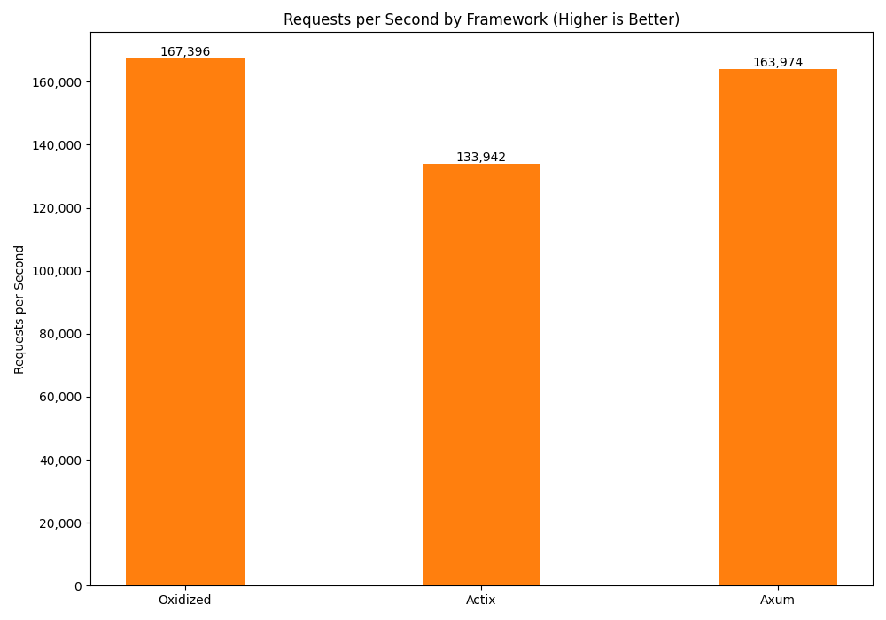
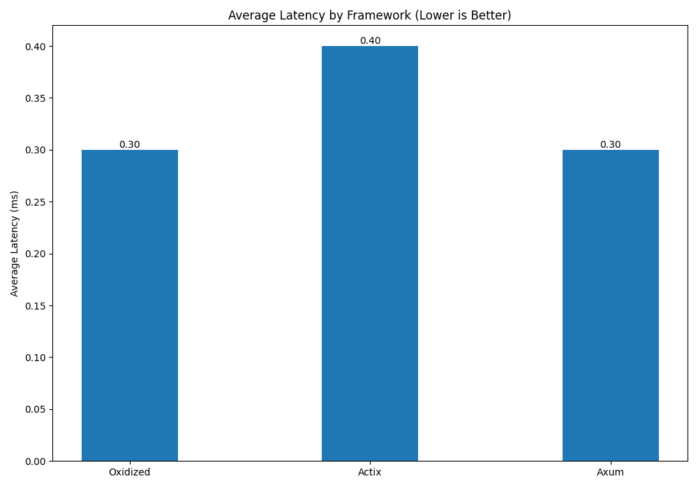

<p align="center">
  
</p>

<h1 align="center">Oxidized</h1>

<p align="center">
  <strong>A hyper-performant, modular, and asynchronous web framework for Rust.</strong>
</p>

<br>

Oxidized is a next-generation web framework engineered for maximum performance and developer ergonomics. Built upon the robust foundations of `hyper`, `tokio`, and `rustls`, it provides a scalable, type-safe environment for building sophisticated web services and APIs. The architecture is heavily influenced by the `Tower` ecosystem, utilizing a `Service` and `Layer` (middleware) abstraction to promote modularity and reusability.

## 🚀 Performance

Performance is a primary design goal of Oxidized. The framework is architected to minimize overhead and maximize throughput. To quantify its performance characteristics, here is how it stacks up against prominent Rust web frameworks, `Actix` and `Axum`.

The benchmark scenario consists of a simple endpoint, testing performance through one connection.

## ✨ Features

- **Asynchronous Core**: Built on `tokio` for non-blocking I/O and scalable concurrency.
- **Zero-Cost Abstractions**: Designed to be lightweight, ensuring minimal performance overhead.
- **Type-Safe Handlers**: Leverage Rust's powerful type system to define handlers with compile-time safety.
- **Powerful Extractor System**: Declaratively extract data from requests, from JSON bodies (`Json<T>`) to custom types.
- **Modular Middleware**: A `Layer`-based middleware system, inspired by `Tower`, for composing request/response logic.
- **High-Performance Routing**: A hashmap-based router for efficient path dispatching.
- **Integrated TLS**: Secure your services with `TLS` out-of-the-box, powered by `rustls`.
- **WebSocket Support**: Built-in support for WebSocket upgrades and communication.

## ⚙️ Getting Started

Install via,

```bash
cargo add oxidized
```

Below is a canonical "Hello, World!" application demonstrating the fundamental components of Oxidized.

```rust
use oxidized::{Response, Result, Router, Server};
use std::net::SocketAddr;

// Define a type-safe handler function.
// The handler is an `async` function that returns a `Result<Response>`.
async fn hello() -> Result<Response> {
    Ok(Response::new("Hello, World!"))
}

#[tokio::main]
async fn main() {
    // Instantiate a new router and define a GET route for the root path.
    let router = Router::new().get("/", hello);

    // Define the socket address for the server.
    let addr = SocketAddr::from(([127, 0, 0, 1], 3000));
    println!("Oxidized server listening on {}", addr);

    // Create a new server with the router and address, and run it.
    Server::new(router, addr).run().await.unwrap();
}
```

Read Docs.md to get a better understanding

### Requests Per Second (Throughput)

This metric indicates the number of requests the server can handle per second. Higher is better.



### Average Latency

This metric represents the average time taken to process a single request. Lower is better.



### Analysis

The empirical results demonstrate that `Oxidized` is highly competitive, exhibiting throughput and latency profiles on par with `Axum`, a framework renowned for its performance. The data suggests that `Oxidized`'s lightweight abstraction layer and efficient request lifecycle management contribute to its negligible overhead, positioning it as a premier choice for high-concurrency, low-latency applications.